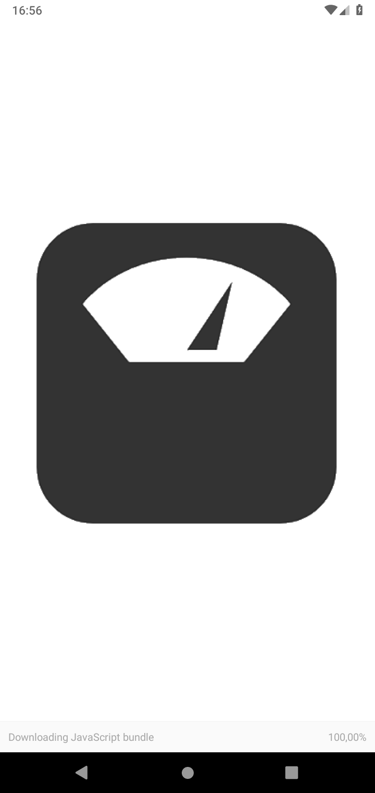
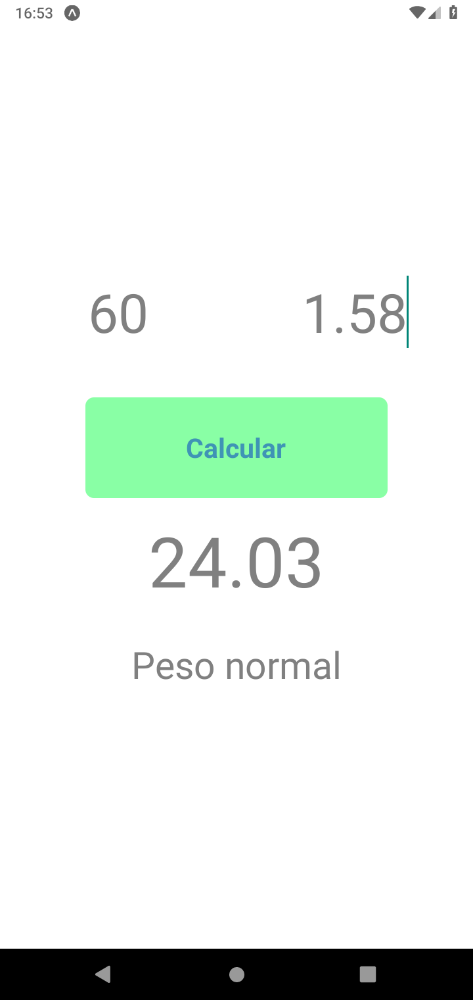
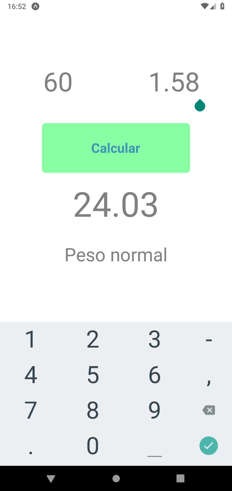

# BMI Calc

A body mass index calculator made with react native.

## Screenshots
### Android:

### iOS

Developed this project while trying to understand in a minimal way how to work with state using useState.